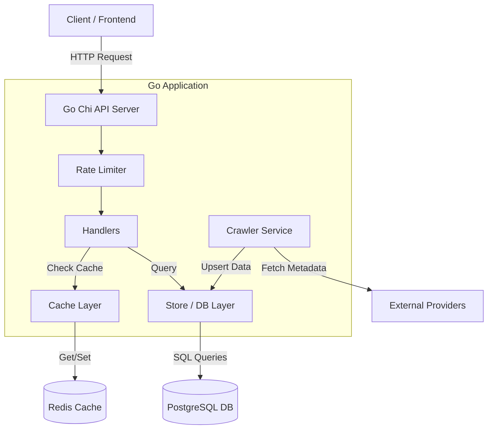

# Go AVDB

Backend service for AVDB built with Go. Features a crawler and REST API.

## Architecture



## Features

- **Crawler**: Concurrent crawler to fetch video metadata from providers.
- **REST API**
- **Caching**: Redis caching layer for high-traffic endpoints. (optional)
- **Rate Limiting**: Built-in fixed window rate limiter. (optional)

## Tech Stack

- **Language**: Go
- **Database**: PostgreSQL (pgx driver)
- **Cache**: Redis
- **Migration**: Golang Migrate
- **Docs**: Swagger/OpenAPI

## Getting Started

### Prerequisites

- Go 1.25
- Docker & Docker Compose

### Running Locally

1. **Clone the repository**

```bash
git clone https://github.com/baobei23/go-avdb.git
cd go-avdb

```

2. **Environment Setup** Copy the example env file and load the configuration:

```bash
cp .envrc.example .envrc
# Edit .envrc with your configuration if needed
source .envrc  # Or use 'direnv allow'

```

3. **Start Dependencies (DB & Redis)**

```bash
docker-compose up -d

```

4. **Run Migrations**

```bash
make migrate-up

```

5. **Start Server**

```bash
go run ./cmd/server
# or
air
```

> Server running at: **http://localhost:8080**

## API Documentation

Swagger documentation is available at:
`http://localhost:8080/swagger/index.html`

## License

[MIT](LICENSE)
